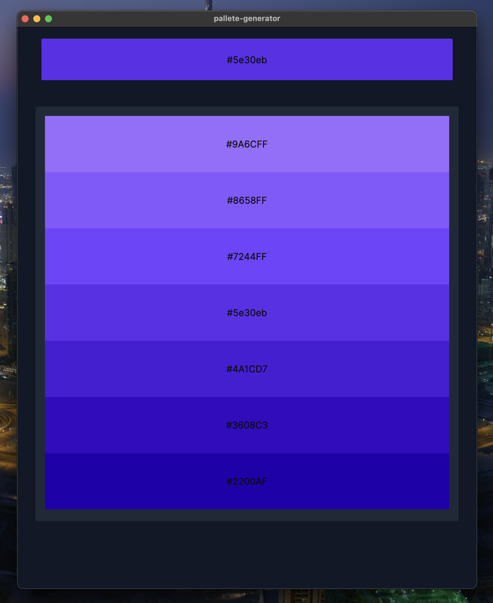

# Color Pallete generator

> WIP

This desktop application takes a single color and return a list of colors that are similar to the original one.

## How to use

Currently no executable is available, so you need to run the application from the source code.

## Technologies

- Rust
- Tauri
- Nextjs
- Tailwindcss
- ShadCN UI

### Requirements

- Rust with cargo
- Node.js with npm

### Running the application

1. Clone the repository
2. Run `npm install` in the root directory
3. Run `cargo tauri dev` in the root directory

